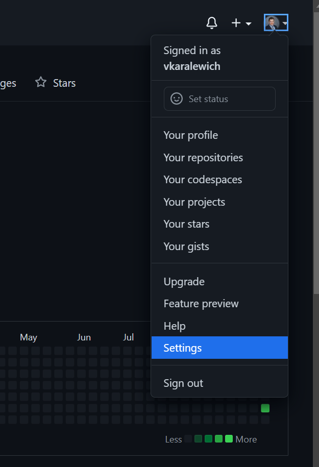
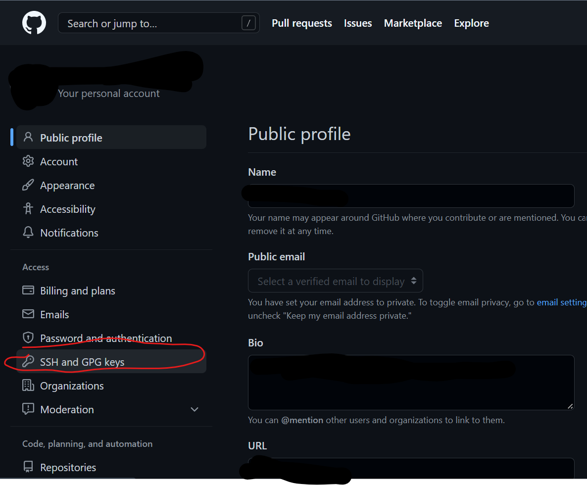
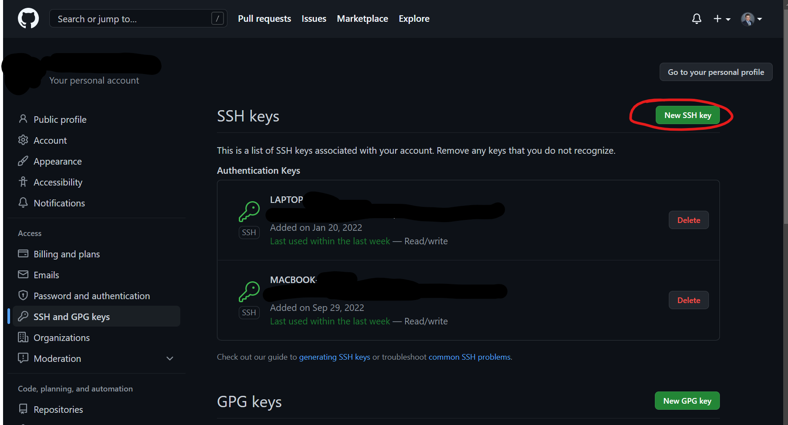

# Git Setup

Git is the premier version control system, invented by Linus Torvalds of Linux fame.

You can use git for many things

- I put all course materials up as a git repository
  - Any time I update materials, you can get the latest version
- You can store all your programming in git repositories. That way if your computer is broken, lost or stolen, all your code is still safely backed up.
- If you push code in every time you make a change, then if you don't like the last 3 changes (or more) you can go back to an older version. Every modification you make is saved.
- You can save your work on one computer, and bring it up on a different computer quickly.
- You can work together with a team on projects, sharing files using git as the communications medium

# Setting up git and a Github account
1. Download git [windows or Mac](https://git-scm.com/downloads) It is also available on that site for linux, but generally in linux just install the one from your distro. For example in ubuntu: ```sudo apt install git ```
1. Get an account on github. [Students get a special deal](https://education.github.com/pack). If you are not a student they want you to pay a monthly fee if you want private repositories. Public (open source) are always free. Github is the biggest but there are also other vendors providing online git repositories. [Gitlab](https://about.gitlab.com/) [Bitbucket](https://bitbucket.org/product/)

1. This document assumes you are using github. In order not to have to type your userid and password, you need to set up ssh digital authentication:

```bash
ssh-keygen -t rsa   # creates id_rsa and id_rsa.pub
```

on linux or Mac, the file will be in your home directory in a hidden directory called .ssh. On windows, it depends on what you are using. If you are using an MSYS2 shell so you can build C++ code in a linux-like environment, then it's just like Linux, but your home directory is located under MSYS2. Typically ```c:/msys64/home/youruserid/.ssh``` If you install git under windows, then it will be located in your windows home directory ```c:/Users/youruserid/.ssh```

 To display your public key in a Unix shell (Linux, Mac or MSYS2):

```bash
cat ~/.ssh/id_rsa.pub
```

In windows cmd shell it would be similar:
```bash
type c:\Users\yourhomedir\.ssh\id_rsa.pub
```

Of course you can also use the windows file explorer to find the file without using a command line, what matters is to display the text so you can copy it.

You will see something like this:

```bash
ssh-rsa AAAAB3NzaC1yc2EAAAADBQABAABBgMDthddGEsBhWIY7fsMuFEFFfjZcwnhvrE7R7FMPgXKcIDkBcaPmacKvgfzvFEGT0Tnxuaud+3hqKHvOeI0iGub/vJM+M1+V2CSrFZIloPEJMKblF/KAB5n3AIUVxnu3R5kmZEIfCGJxLbJ+Gub7KOpUWGlMp6ryDur5gpNwPaQ1LbxAdieK4iE0iZuQ9wtUlYReSYWEzMltEPGIgN2TMBZG2HTJYKQa89yBEYFiflKpLwfrwU33bsO5bpG2LKZcIm77DyVFhqmM1rS6BbclPQkWVetFaeLkegNNOU7PcXmp5vPU3yMc9702lUfsyCUTj6XrE5xVh7P6p630uvDPioWvqMMijgJ7nGqHYGZwxnAirEVEFTOLLb4v6l/1yIlcg51GQ9or7Nb/x1qL8Q8ABYh5j99uLahk61gMOaBVI/CjNt5GlqULafdIBYdRc0sDnpsSSZzI+5xFzfMT+lEKKiP6k4cDUu7UjwMpvmoZ9UDRiLh0PTb1mia7vnkzjkNtckE= dkruger@infinitooli

```

You then need to copy this text and paste it on github.

1. Log into github.
2. Click onto your user icon on the top right, then go to Settings.
    

3. Click on ssh and gpg keys on the left.
    

4. Click on new ssh key and paste in the key. If you have multiple computers, make sure the name of the key makes it clear which computer it is so you can keep track.
  

You will use git to pull any changes I make to course examples, and also to work together in groups.

Git will require you to generate an ssh key in your home directory. Where that is depends on your environment
(Windows, MSYS2, Mac/Linux)

You will also need a Github account. Github is a website that offers online hosting of git repositories. All my class examples are hosted on git, and in some cases you will be asked to submit larger homeworks using git. In any case as a programmer, this is something everyone should know. [Link to get an educational GitHub account (free features)](https://education.github.com/)

## msys2 install guide

1. Get a github student account: <https://education.github.com/pack>;

2. Download git
  
    ```bash
    pacman -S git
    ```

3. Create a public/private key pair

    ```bash
    ssh-keygen -a 100 -t ed25519
    ```

    this creates the .ssh directory in your home directory. On Linux and mac, ~/.ssh

    On windows under msys2: c:/msys64/home/yourusername/.ssh
    On windows c:\Users\yourusername\.ssh

    There will be two files: id_ed25519  id_ed25519.pub

    id_ed25519 is your PRIVATE KEY. Do not share with anyone
    id_ed25519.pub is your PUBLIC KEY. This is how github will know who you are.

4. From now on the commands shown are in linux command line. For Windows you can do the equivalent.

    Display your public key:

    cat ~/.ssh/id_ed25519.pub

    for example:

    ssh-ed25519 AAAAB3NzaC1yc2EAAAADAQABAAABgQDthddGErBhWIY7gtHuGE74fjZcwnhvrE7R7FMPgXKcIDkBcaPmacKvgfzvFEGT0Tnxuaud+3hqKHvOeI0iGub/vJM+M1+V2CSrFZIloPEJMKblF/KAB5n3AIUVxnu3R5kmZEIfCGJxLbJ+Gub7KOpUWGlMp6ryDur5gpNwPaQ1LbxAdieK4iF9iZuM9wrUlYReSYWEzMltEPGIgN2TMBZG2HTJYKQa89yBEYFiflKpLwfrwU33bsO5bpG2LKZcIm77DyVFhqmM1rS6BbclPQkWVetFaeLkegNNOU7PcXmp5vPU3yMc9702lUfsyCUTj6XrE5xVh7P6p630uvDPioWvqMMijgJ7nfrHYGzwXnAirEVEFTOLLb4v6l/1yIlcg51GQ9or7Nb/x1qL8Q8ABYh5j99uLahk61gMOaBVI/CjNt5GlqULafdIBYdRc0sDnpsSSZzI+5xFzfMT+lEKKiP6k4cDUu7UjwMpvmoZ9UDRiLh0PTb1mia7vnkzjkNtckE= dkruger@infin

5. Log into github.com Click on your id (top right)

    

6. Click on your icon, settings:

    

7. 

8. Add an ssh key and past in your public key. Label the key in case you have multiple computers so you can track which one is which.

9. I suggest creating a directory for git, all your git repos can go under here. You can use any tool you like, I use mkdir:

    ```bash
    mkdir ~/git
    ```

    The above command creates a new directory git under your home directory.

    At the command line, change directory so you are in the git directory:

    ```bash
    cd ~/git
    ```

10. Test your setup by trying to clone the repo for your class. First go to the repository on gitub.com Example: C++

    

11. Click on the green button and copy the SSH url (DO NOT get the HTTPS url, because if you do you will have to type your password every time, it’s a huge pain)

    

12. Clone the repository:

    Examples shown for all courses

    ```bash
    git clone git@github.com:StevensDeptECE/CPE553-CPP.git
    git clone git@github.com:StevensDeptECE/CPE552-Java.git
    git clone git@github.com:StevensDeptECE/CPE593.git
    git clone git@github.com:StevensDeptECE/CPE390.git
    ```

13. You now have all the code for the course in the directory. If I ever add material to the repo and push it up, all you have to do

    ```bash
    cd ~/git/CPE593    # change directory to get into your class repo on your computer
    git pull            # get all the changes (you are now up to date)
    ```

14. For a group project repo, such as CPE-552-Group or CPE-553-Group
    you will have to accept an invitation to join because the repo is private.

    Look for an invitation from github.com in your email or log into github and click on notifications:

15. Creating your own repo. If you were asked to create an individual repo as an assignment, you will be given a link. Clicking on this link will create a private repo that only you and your instructor and TA can see. For a group project you will need to manually create a repo. Steps:
    - One of you go to github.com/yourname.
    - Login

16. How to add others to your repo:

    - In your repo, click on Settings, then Manage Access.
    - You need to know the github ids of all parties. Give them access they need. For most members of your team, write access is enough. Admin access means they can add/remove members from the team, AND ALSO DELETE THE ENTIRE REPO.

17. Forking a repository

    - On the internet when we don’t know other people, instead of letting them have write access to your repo, they typically fork it. Forking makes a copy of your repo on github.
    - The person who forked then clones the new repo to their computer. They start working.
    - When they have something to contribute, they create a pull request, asking you (the owner of the parent repo) to take their good idea and make it part of the parent project.

18. Setting changes in a parent project to update locally: Suppose homework is posted in CPE-390hw. All students are given individual repos which fork off the parent but are private. Sometime later, the parent repo is changed to add a new homework. How do students get the new homework? You need to set your repo to update when the parent is changed as follows:

    ```bash
    git fetch upstream
    git merge upstream/master
    ```

|  |  |
|--|--|
| Getting the most recent version of a repo | git pull |
| Putting in all changes in the current directory | git add . git commit -m”comment describing the update” git push |
| git diff myfile | Display the difference between this file and the one in the repo |
| git branch -a | Show all branches in the current repo including the remote ones not pulled here |
| git status | show all the files that are changed and need to be committed |
| git merge branchname | Pull in all changes from branch into the current branch. Any files that can be automatically merged are. Files that git cannot figure out, where two edits occur on the same line have conflicts which a human must resolve. |
| git checkout branch -- filename | Replace current file(s) in this branch with the named files from another branch. This is good for pulling in files from another  branch, or just wiping out a change and pulling in the original file again |
| git checkout [hexcode of commit] | This pulls in a specific commit and makes it current, ie go back to an known time. You can get the codes by clicking on commits in github and going back through the changes until you find the one you want. |

Find out how much one author in git has been committing

```bash
git log --author="<authorname>" --oneline --shortstat
```

If you want to really learn git you can also read the manual, but that's a real book (350 pages).
[Git manual](https://git-scm.com/docs/user-manual)

# Cloning a Repo
1. Go and grab the web url of the repository you would like to clone

2. In the terminal:
```bash
git clone <url>
```

# Updating a Repo
1. cd to your repository, and excecute the follwing:
```bash
git add .
```
2. You can also run git status to see changes that you have made to files.  Then commit to repository and describe the changes you made in the required message field.
```bash
git commit -m "message"
```
3. Finally, push to the repository:
```bash
git push
```

# Pulling from a Repo
You must have already cloned the repository.  Cd to the local repository on your computer and run:
```bash
git pull
```
This should be done often, to reduce collisions when pushing your changes back into GitHub.